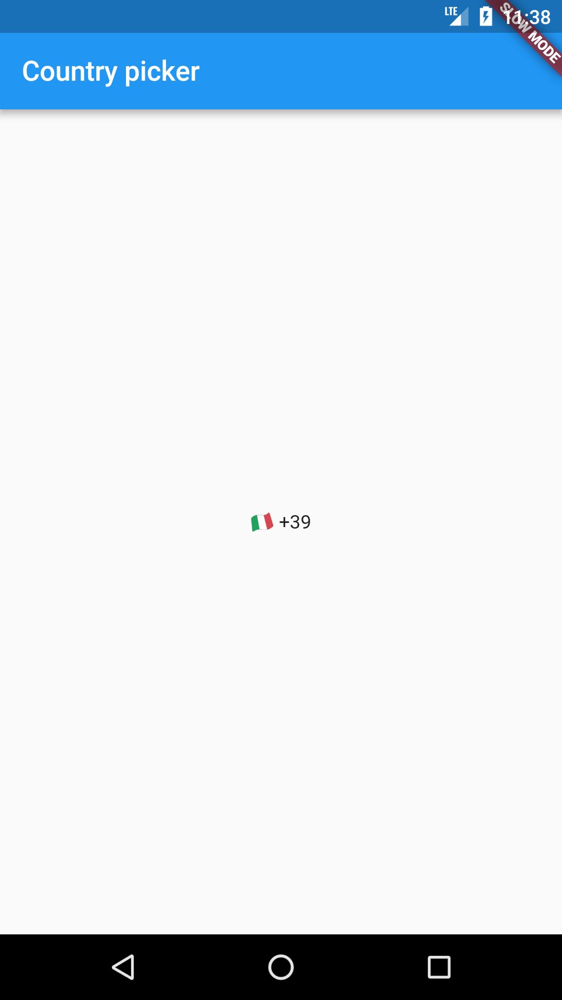
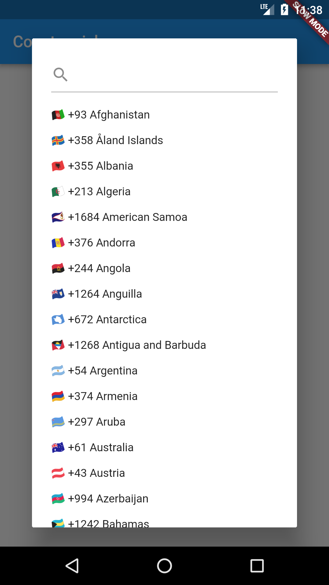
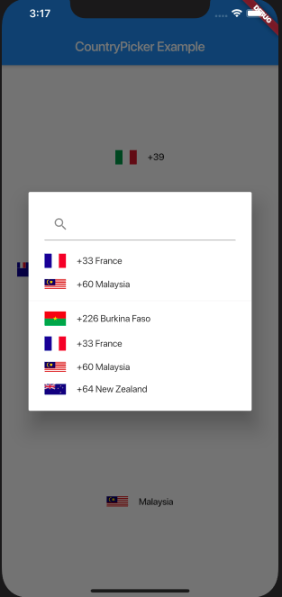

# country_code_picker

A flutter package for showing a country code selector.





## Usage

Just put the component in your application setting the onChanged callback.

 ```dart
 ......
 @override
  Widget build(BuildContext context) => new Scaffold(
      body: new Center(
        child: new CountryCodePicker(
          onChanged: print,
        ),
      ));
.....
 ```

 It's also possible to select the initial selection using the country code.

## Known issues

- On iOS the icons are not showned
